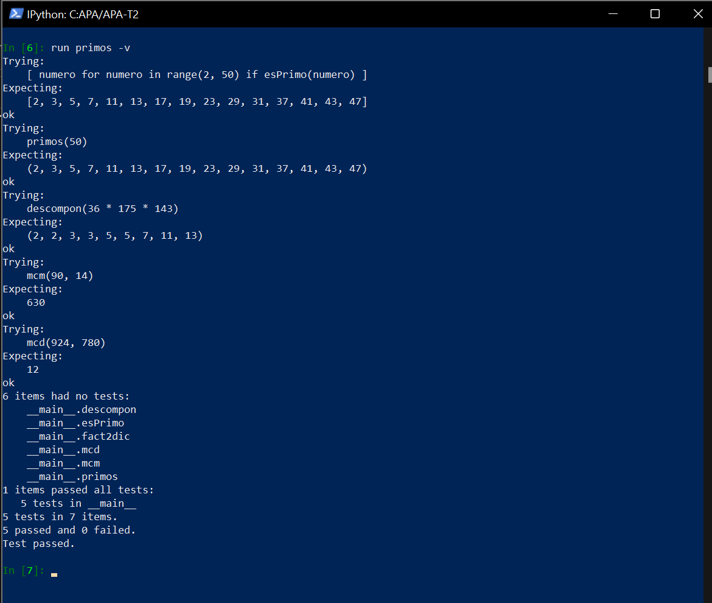

# Segunda tarea de APA 2023: Manejo de números primos

## Nom i cognoms Arnau Montiel Morales

## Fichero `primos.py`

- El alumno debe escribir el fichero `primos.py` que incorporará distintas funciones relacionadas con el manejo
  de los números primos.

- El fichero debe incluir una cadena de documentación que incluirá el nombre del alumno y los tests unitarios
  de las funciones incluidas.

- Cada función deberá incluir su propia cadena de documentación que indicará el cometido de la función, los
  argumentos de la misma y la salida proporcionada.

- Se valorará lo pythónico de la solución; en concreto, su claridad y sencillez, y el uso de los estándares marcados
  por PEP-8. También se valorará su eficiencia computacional.

### Determinación de la *primalidad* y descomposición de un número en factores primos

Incluya en el fichero `primos.py` las tres funciones siguientes:

- `esPrimo(numero)`   Devuelve `True` si su argumento es primo, y `False` si no lo es.
- `primos(numero)`    Devuelve una **tupla** con todos los números primos menores que su argumento.
- `descompon(numero)` Devuelve una **tupla** con la descomposición en factores primos de su argumento.

### Obtención del mínimo común múltiplo y el máximo común divisor

Usando las tres funciones del apartado anterior (y cualquier otra que considere conveniente añadir), escriba otras
dos que calculen el máximo común divisor y el mínimo común múltiplo de sus argumentos:

- `mcm(numero1, numero2)`:  Devuelve el mínimo común múltiplo de sus argumentos.
- `mcd(numero1, numero2)`:  Devuelve el máximo común divisor de sus argumentos.

Estas dos funciones deben cumplir las condiciones siguientes:

- Aunque se trate de una solución sub-óptima, en ambos casos deberá partirse de la descomposición en factores
  primos de los argumentos usando las funciones del apartado anterior.

- Aunque también sea sub-óptimo desde el punto de vista de la programación, ninguna de las dos funciones puede
  depender de la otra; cada una debe programarse por separado.

### Obtención del mínimo común múltiplo y el máximo común divisor para un número arbitrario de argumentos
Escriba las funciones mcmN() y mcdN(), que calculan el mínimo común múltiplo y el máximo común divisor para un número arbitrario de argumentos:

- `mcmN(*numeros)`: Devuelve el mínimo común múltiplo de sus argumentos.
- `mcdN(*numeros)`: Devuelve el máximo común divisor de sus argumentos.

### Tests unitarios

La cadena de documentación del fichero debe incluir los tests unitarios de las cinco funciones. En concreto, deberán
comprobarse las siguientes condiciones:

- `esPrimo(numero)`:  Al ejecutar `[ numero for numero in range(2, 50) if esPrimo(numero) ]`, la salida debe ser
                      `[2, 3, 5, 7, 11, 13, 17, 19, 23, 29, 31, 37, 41, 43, 47]`.
- `primos(numeor)`: Al ejecutar `primos(50)`, la salida debe ser `(2, 3, 5, 7, 11, 13, 17, 19, 23, 29, 31, 37, 41, 43, 47)`.
- `descompon(numero)`: Al ejecutar `descompon(36 * 175 * 143)`, la salida debe ser `(2, 2, 3, 3, 5, 5, 7, 11, 13)`.
- `mcm(num1, num2)`: Al ejecutar `mcm(90, 14)`, la salida debe ser `630`.
- `mcd(num1, num2)`: Al ejecutar `mcd(924, 780)`, la salida debe ser `12`.
- `mcmN(numeros)`: Al ejecutar `mcm(42, 60, 70, 63)`, la salida debe ser `1260`.
- `mcdN(numeros)`: Al ejecutar `mcd(840, 630, 1050, 1470)`, la salida debe ser `210`.

### Entrega

#### Ejecución de los tests unitarios

Inserte a continuación una captura de pantalla que muestre el resultado de ejecutar el fichero `primos.py` con la opción
*verbosa*, de manera que se muestre el resultado de la ejecución de los tests unitarios.


<p>
<p\>


<p>
<p\>

#### Código desarrollado

Inserte a continuación el contenido del fichero `primos.py` usando los comandos necesarios para que se realice el
realce sintáctico en Python del mismo.
<p>
<p\>

```python
"""
Arnau Montiel Morales

Modulo de gestión de números primos

Exemples: 
>>> [ numero for numero in range(2, 50) if esPrimo(numero) ]
[2, 3, 5, 7, 11, 13, 17, 19, 23, 29, 31, 37, 41, 43, 47]

>>> primos(50)
(2, 3, 5, 7, 11, 13, 17, 19, 23, 29, 31, 37, 41, 43, 47)

>>> descompon(36 * 175 * 143)
(2, 2, 3, 3, 5, 5, 7, 11, 13)

>>> mcm(90,14)
630

>>> mcd(924,780)
12

>>> mcmN(42,60,70,63)
1260

>>> mcdN(840,630,1050,1470)
210

"""

def esPrimo(numero):
    """
     Devuelve True si su argumento es primo, y False si no lo es.
    """

    for prova in range(2,int(numero**0.5+1)):
        if numero % prova == 0:
            return False
    return True

def primos(numero):
    """
    Devuelve una tupla con todos los números primos menores que su argumento.
    """

    return tuple([prova for prova in range(2, numero) if esPrimo(prova)])

def descompon(numero):
    """
    Devuelve una **tupla** con la descomposicion en factores primos.
    """
    factores= tuple()
    for factor in primos(numero+1):
        while numero % factor == 0:
            numero = numero // factor
            factores= factores + (factor,)

    return factores

def fact2dic(numero1,numero2):
    """
    Crea dos diccionarios,cada uno para su argumento ,con los valores del factor y el exponente. ej: 12={2:2,3:1}  2*2*3*1=12
    """
    factores1 = descompon(numero1)
    factores2 = descompon(numero2)
    factores = set(factores1) | set(factores2) #tupla  a 2 conjuntos 
    
    dic1= {factor : 0 for factor in factores}
    dic2={factor : 0 for factor in factores}
    for factor in factores1:
        dic1[factor]+=1
        
        
    for factor in factores2:
        dic2[factor]+=1 
        
    return dic1, dic2

def mcm(numero1,numero2):
    """
    Devuelve minimo común múltiplo de sus argumentos.
    """
    dic1, dic2= fact2dic(numero1,numero2)
    mcm = 1 
    for factor in dic1:
        mcm *= factor** max(dic1[factor],dic2[factor]) #mcm*
    return mcm

def mcd(numero1,numero2):
    """
    Devuelve el máximo común divisor de sus argumentos.
    """
    dic1, dic2= fact2dic(numero1,numero2)
    mcd = 1 
    for factor in dic2:
        mcd *= factor ** min(dic1[factor],dic2[factor])
    return mcd
    
def fact2dicN(numero):
    """
    Crea dos diccionarios,cada uno para su argumento ,con los valores del factor y el exponente. ej: 12={2:2,3:1}  2*2*3*1=12
    """
    factoresN = descompon(numero)
    ##factores2 = descompon(numero2)
    factores = set(factoresN) #tupla  a 2 conjuntos 
    
    dic1= {factor : 0 for factor in factores}
    ##dic2={factor : 0 for factor in factores}
    for factor in factoresN:
        dic1[factor]+=1
        
        
    ##for factor in factores2:
       ## dic2[factor]+=1 
        
    return dic1##, dic2


def mcmN(*numeros):
    """
    Devuelve el mínimo común múltiplo de sus argumentos para un numeros arbitrario de argumentos.
    """
    
    lista_dic=[]
    
    for factor in range(0,len(numeros)):
             
       N= numeros[factor] 
       dic1 = fact2dicN(N)
       
       lista_dic.append(dic1)  
       
    mcm = 1 
    mcm2 = 1 
    mcm1 = 1
    mcm3 = 1 
    mcm4 = 1 
    iterador= iter(lista_dic)
    dic1 = next(iterador)                
    ##print(dic1)
    dic2 = next(iterador)
    ##print(dic2)
    dic3 = next(iterador)
    ##print(dic3)
    dic4 = next(iterador)
    ##print(dic4)
  
    for factor in dic1:
      
      mcm1*= factor** max(dic1.values()) #mcm*
      mcm2*= factor** max(dic2.values())
      mcm3*= factor** max(dic3.values())
      mcm4*= factor** max(dic4.values())
      
      mcm = mcm1+ mcm2 +mcm3+ mcm4
    return mcm


def mcdN(*numeros):
    """
    Devuelve el máximo común divisor de sus argumentos para un numeros arbitrario de argumentos.
    """
    lista_dic=[]
    
    for factor in range(0,len(numeros)):
             
       N= numeros[factor] 
       dic1 = fact2dicN(N)
       
       lista_dic.append(dic1)  
       
    mcm = 1 
    mcm2 = 1 
    mcm1=1
    mcm3 = 1 
    mcm4 = 1 
    iterador= iter(lista_dic)
    dic1 = next(iterador)
                     
    ##print(dic1)
    
    dic2 = next(iterador)
    ##print(dic2)
    dic3 = next(iterador)
    ##print(dic3)
    dic4 = next(iterador)
    ##print(dic4)
  
    for factor in dic1:
      
      mcm1*= factor** min(dic1.values()) #mcm*
      mcm2*= factor** min(dic2.values())
      mcm3*= factor** min(dic3.values())
      mcm4*= factor** min(dic4.values())
      
      mcm = mcm1+ mcm2 +mcm3+ mcm4
    return mcm


import doctest
doctest.testmod()
```

#### Subida del resultado al repositorio GitHub ¿y *pull-request*?

El fichero `primos.py`, la imagen con la ejecución de los tests unitarios y este mismo fichero, `README.md`, deberán
subirse al repositorio GitHub mediante la orden `git push`. Si los profesores de la asignatura consiguen montar el
sistema a tiempo, la entrega se formalizará realizando un *pull-request* al propietario del repositorio original.

El fichero `README.md` deberá respetar las reglas de los ficheros Markdown y visualizarse correctamente en el repositorio,
incluyendo la imagen con la ejecución de los tests unitarios y el realce sintáctico del código fuente insertado.
