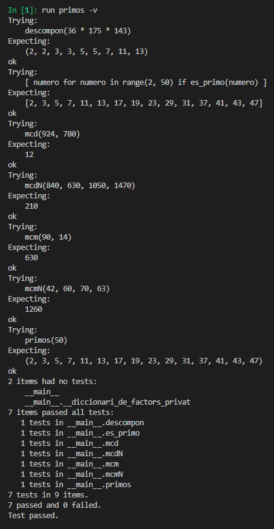

# Segunda tarea de APA 2023: Manejo de números primos

## Nom i cognoms: Alexandr Ramos

## Fichero `primos.py`

- El alumno debe escribir el fichero `primos.py` que incorporará distintas funciones relacionadas con el manejo
  de los números primos.

- El fichero debe incluir una cadena de documentación que incluirá el nombre del alumno y los tests unitarios
  de las funciones incluidas.

- Cada función deberá incluir su propia cadena de documentación que indicará el cometido de la función, los
  argumentos de la misma y la salida proporcionada.

- Se valorará lo pythónico de la solución; en concreto, su claridad y sencillez, y el uso de los estándares marcados
  por PEP-8. También se valorará su eficiencia computacional.

### Determinación de la *primalidad* y descomposición de un número en factores primos

Incluya en el fichero `primos.py` las tres funciones siguientes:

- `esPrimo(numero)`   Devuelve `True` si su argumento es primo, y `False` si no lo es.
- `primos(numero)`    Devuelve una **tupla** con todos los números primos menores que su argumento.
- `descompon(numero)` Devuelve una **tupla** con la descomposición en factores primos de su argumento.

### Obtención del mínimo común múltiplo y el máximo común divisor

Usando las tres funciones del apartado anterior (y cualquier otra que considere conveniente añadir), escriba otras
dos que calculen el máximo común divisor y el mínimo común múltiplo de sus argumentos:

- `mcm(numero1, numero2)`:  Devuelve el mínimo común múltiplo de sus argumentos.
- `mcd(numero1, numero2)`:  Devuelve el máximo común divisor de sus argumentos.

Estas dos funciones deben cumplir las condiciones siguientes:

- Aunque se trate de una solución sub-óptima, en ambos casos deberá partirse de la descomposición en factores
  primos de los argumentos usando las funciones del apartado anterior.

- Aunque también sea sub-óptimo desde el punto de vista de la programación, ninguna de las dos funciones puede
  depender de la otra; cada una debe programarse por separado.

### Obtención del mínimo común múltiplo y el máximo común divisor para un número arbitrario de argumentos

Escriba las funciones `mcmN()` y `mcdN()`, que calculan el mínimo común múltiplo y el máximo común divisor para un
número arbitrario de argumentos:

- `mcmN(*numeros)`:  Devuelve el mínimo común múltiplo de sus argumentos.
- `mcdN(*numeros)`:  Devuelve el máximo común divisor de sus argumentos.

### Tests unitarios

La cadena de documentación del fichero debe incluir los tests unitarios de las cinco funciones. En concreto, deberán
comprobarse las siguientes condiciones:

- `esPrimo(numero)`:  Al ejecutar `[ numero for numero in range(2, 50) if esPrimo(numero) ]`, la salida debe ser
                      `[2, 3, 5, 7, 11, 13, 17, 19, 23, 29, 31, 37, 41, 43, 47]`.
- `primos(numeor)`: Al ejecutar `primos(50)`, la salida debe ser `(2, 3, 5, 7, 11, 13, 17, 19, 23, 29, 31, 37, 41, 43, 47)`.
- `descompon(numero)`: Al ejecutar `descompon(36 * 175 * 143)`, la salida debe ser `(2, 2, 3, 3, 5, 5, 7, 11, 13)`.
- `mcm(num1, num2)`: Al ejecutar `mcm(90, 14)`, la salida debe ser `630`.
- `mcd(num1, num2)`: Al ejecutar `mcd(924, 780)`, la salida debe ser `12`.
- `mcmN(numeros)`: Al ejecutar `mcm(42, 60, 70, 63)`, la salida debe ser `1260`.
- `mcdN(numeros)`: Al ejecutar `mcd(820, 630, 1050, 1470)`, la salida debe ser `210`.

### Entrega

#### Ejecución de los tests unitarios

Inserte a continuación una captura de pantalla que muestre el resultado de ejecutar el fichero `primos.py` con la opción
*verbosa*, de manera que se muestre el resultado de la ejecución de los tests unitarios.



#### Código desarrollado

Inserte a continuación el contenido del fichero `primos.py` usando los comandos necesarios para que se realice el
realce sintáctico en Python del mismo.

```` python
"""
Alexandr Ramos
"""

def es_primo(numero):
    """
    Devuelve True si su argumento es primo, y False si no lo es.

    >>> [ numero for numero in range(2, 50) if es_primo(numero) ]
    [2, 3, 5, 7, 11, 13, 17, 19, 23, 29, 31, 37, 41, 43, 47]
    """
    #Busca divisors amb residu 0 entre els valors 2 i nuermo*sqrt(2)
    for prueba in range(2, int(numero**0.5)+1):     
        if numero % prueba == 0: return False

    return True    


def primos(numero):
    """
    Devuelve una tupla con todos los números primos menores que su argumento.
    >>> primos(50)
    (2, 3, 5, 7, 11, 13, 17, 19, 23, 29, 31, 37, 41, 43, 47)
    """
    # Aplico una "comprehension" per generar una tupla valorant es_primo(valor)
    return tuple([valor for valor in range(2, numero) if es_primo(valor)])


def descompon(numero):
    """
    Devuelve una tupla con la descomposición en factores primos de su argumento.
    >>> descompon(36 * 175 * 143)
    (2, 2, 3, 3, 5, 5, 7, 11, 13)
    """
    factores = []

    #Sempre que sigui divisible amb residu 0, s'afegeix a la tupla
    for factor in primos(numero):
        while numero%factor == 0:
            factores.append(factor)
            numero //= factor
    return tuple(factores)


def __diccionari_de_factors_privat(numero1, numero2):
    """
    Clase privada que genera 2 diccionaris que relaciona quants factors n'hi ha de cada.
    """
    # Em paso tots els possibles factors en un sol conjunt factors
    factors_1 = descompon(numero1)
    factors_2 = descompon(numero2)
    factors = set(factors_1 + factors_2)

    # Genero 2 dicionaris amb cada possible factor com a clau i vegades a multiplicar com a valor
    diccionari_factors_1 = {factor:0 for factor in factors}
    diccionari_factors_2 = {factor:0 for factor in factors}
    for factor in factors_1: diccionari_factors_1[factor] += 1
    for factor in factors_2: diccionari_factors_2[factor] += 1
    return diccionari_factors_1, diccionari_factors_2


def mcm(numero1, numero2):
    """"
    Devuelve el mínimo común múltiplo de sus argumentos
    >>> mcm(90, 14)
    630
    """
    mcm = 1
    diccionari_factors_1, diccionari_factors_2 = __diccionari_de_factors_privat(numero1, numero2)
    
    # Multimplique els factors elevats al maxim de la seva aparició per factor.
    for factor in diccionari_factors_1 | diccionari_factors_2:
        mcm *= factor ** max(diccionari_factors_1[factor], diccionari_factors_2[factor])
    return mcm


def mcd(numero1, numero2):
    """
    Devuelve el máximo común divisor de sus argumentos.
    >>> mcd(924, 780)
    12
    """
    mcd = 1
    diccionari_factors_1, diccionari_factors_2 = __diccionari_de_factors_privat(numero1, numero2)

    # Multipliquem els factors elevats al minim de la seva aparició
    for factor in diccionari_factors_1 | diccionari_factors_2:
        mcd *= factor ** min(diccionari_factors_1[factor], diccionari_factors_2[factor])
    return mcd


import doctest
doctest.testmod()
````


#### Subida del resultado al repositorio GitHub ¿y *pull-request*?

El fichero `primos.py`, la imagen con la ejecución de los tests unitarios y este mismo fichero, `README.md`, deberán
subirse al repositorio GitHub mediante la orden `git push`. Si los profesores de la asignatura consiguen montar el
sistema a tiempo, la entrega se formalizará realizando un *pull-request* al propietario del repositorio original.

El fichero `README.md` deberá respetar las reglas de los ficheros Markdown y visualizarse correctamente en el repositorio,
incluyendo la imagen con la ejecución de los tests unitarios y el realce sintáctico del código fuente insertado.
