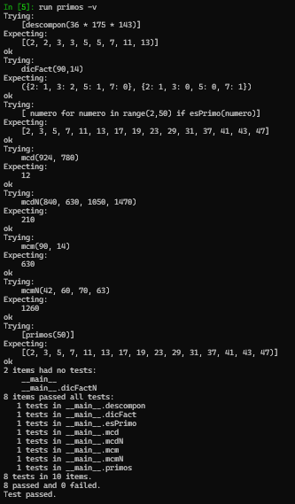

# Segunda tarea de APA 2023: Manejo de números primos

## Nom i cognoms

## Fichero `primos.py`

- El alumno debe escribir el fichero `primos.py` que incorporará distintas funciones relacionadas con el manejo
  de los números primos.

- El fichero debe incluir una cadena de documentación que incluirá el nombre del alumno y los tests unitarios
  de las funciones incluidas.

- Cada función deberá incluir su propia cadena de documentación que indicará el cometido de la función, los
  argumentos de la misma y la salida proporcionada.

- Se valorará lo pythónico de la solución; en concreto, su claridad y sencillez, y el uso de los estándares marcados
  por PEP-8. También se valorará su eficiencia computacional.

### Determinación de la *primalidad* y descomposición de un número en factores primos

Incluya en el fichero `primos.py` las tres funciones siguientes:

- `esPrimo(numero)`   Devuelve `True` si su argumento es primo, y `False` si no lo es.
- `primos(numero)`    Devuelve una **tupla** con todos los números primos menores que su argumento.
- `descompon(numero)` Devuelve una **tupla** con la descomposición en factores primos de su argumento.

### Obtención del mínimo común múltiplo y el máximo común divisor

Usando las tres funciones del apartado anterior (y cualquier otra que considere conveniente añadir), escriba otras
dos que calculen el máximo común divisor y el mínimo común múltiplo de sus argumentos:

- `mcm(numero1, numero2)`:  Devuelve el mínimo común múltiplo de sus argumentos.
- `mcd(numero1, numero2)`:  Devuelve el máximo común divisor de sus argumentos.

Estas dos funciones deben cumplir las condiciones siguientes:

- Aunque se trate de una solución sub-óptima, en ambos casos deberá partirse de la descomposición en factores
  primos de los argumentos usando las funciones del apartado anterior.

- Aunque también sea sub-óptimo desde el punto de vista de la programación, ninguna de las dos funciones puede
  depender de la otra; cada una debe programarse por separado.

### Obtención del mínimo común múltiplo y el máximo común divisor para un número arbitrario de argumentos

Escriba las funciones `mcmN()` y `mcdN()`, que calculan el mínimo común múltiplo y el máximo común divisor para un
número arbitrario de argumentos:

- `mcmN(*numeros)`:  Devuelve el mínimo común múltiplo de sus argumentos.
- `mcdN(*numeros)`:  Devuelve el máximo común divisor de sus argumentos.

### Tests unitarios

La cadena de documentación del fichero debe incluir los tests unitarios de las cinco funciones. En concreto, deberán
comprobarse las siguientes condiciones:

- `esPrimo(numero)`:  Al ejecutar `[ numero for numero in range(2, 50) if esPrimo(numero) ]`, la salida debe ser
                      `[2, 3, 5, 7, 11, 13, 17, 19, 23, 29, 31, 37, 41, 43, 47]`.
- `primos(numeor)`: Al ejecutar `primos(50)`, la salida debe ser `(2, 3, 5, 7, 11, 13, 17, 19, 23, 29, 31, 37, 41, 43, 47)`.
- `descompon(numero)`: Al ejecutar `descompon(36 * 175 * 143)`, la salida debe ser `(2, 2, 3, 3, 5, 5, 7, 11, 13)`.
- `mcm(num1, num2)`: Al ejecutar `mcm(90, 14)`, la salida debe ser `630`.
- `mcd(num1, num2)`: Al ejecutar `mcd(924, 780)`, la salida debe ser `12`.
- `mcmN(numeros)`: Al ejecutar `mcm(42, 60, 70, 63)`, la salida debe ser `1260`.
- `mcdN(numeros)`: Al ejecutar `mcd(840, 630, 1050, 1470)`, la salida debe ser `210`.

### Entrega

#### Ejecución de los tests unitarios

Inserte a continuación una captura de pantalla que muestre el resultado de ejecutar el fichero `primos.py` con la opción
*verbosa*, de manera que se muestre el resultado de la ejecución de los tests unitarios.

#### Código desarrollado

Inserte a continuación el contenido del fichero `primos.py` usando los comandos necesarios para que se realice el
realce sintáctico en Python del mismo.

#### Subida del resultado al repositorio GitHub ¿y *pull-request*?

El fichero `primos.py`, la imagen con la ejecución de los tests unitarios y este mismo fichero, `README.md`, deberán
subirse al repositorio GitHub mediante la orden `git push`. Si los profesores de la asignatura consiguen montar el
sistema a tiempo, la entrega se formalizará realizando un *pull-request* al propietario del repositorio original.

El fichero `README.md` deberá respetar las reglas de los ficheros Markdown y visualizarse correctamente en el repositorio,
incluyendo la imagen con la ejecución de los tests unitarios y el realce sintáctico del código fuente insertado.



```python

import doctest

def esPrimo(numero):

    """
    Devuelve True si numero es primo y false si no lo es
    >>> [ numero for numero in range(2,50) if esPrimo(numero)]
    [2, 3, 5, 7, 11, 13, 17, 19, 23, 29, 31, 37, 41, 43, 47]
    """

    if numero < 2:
        return False
    else:
        for i in range(2,numero):
            if numero % i == 0:
                return False
        return True

def primos(numero):
    """
    Devuelve una tupla con todos los números primos menores que n.
    >>> [primos(50)]
    [(2, 3, 5, 7, 11, 13, 17, 19, 23, 29, 31, 37, 41, 43, 47)]
    """
    primes = [i for i in range(2, numero) if all(i % j != 0 for j in range(2, i))]
    return tuple(primes)

def descompon(numero):
    """
    Devuelve una tupla con la descomposición en factores primos de numero.
    >>> [descompon(36 * 175 * 143)]
    [(2, 2, 3, 3, 5, 5, 7, 11, 13)]
    """
    factors = []
    for factor in range(2, numero+1):
        while numero % factor == 0:
            factors.append(factor)
            numero //= factor
        if numero < 2:
            break
    return tuple(factors)


def dicFact(numero1,numero2):
    """
    Devuelve el factor primo de un número con su correspondiente exponente. 
    La función tiene como argumento dos números.
    >>> dicFact(90,14)
    ({2: 1, 3: 2, 5: 1, 7: 0}, {2: 1, 3: 0, 5: 0, 7: 1})
    """
    factores1 = descompon(numero1)
    factores2 = descompon(numero2)

    factores = set(factores1 + factores2)  
    dicfact1 ={factor : 0 for factor in factores } 
    dicfact2 ={factor : 0 for factor in factores} 
    for factor in factores1 : dicfact1[factor] += 1 #añade 1 a la clave cada vez que encuentra un factor en el xonjunto
    for factor in factores2 : dicfact2[factor] += 1 
  
    return dicfact1,dicfact2
    
def mcm(numero1, numero2):
    """
    Devuelve el mínimo común múltiplo de los dos argumentos.
    >>> mcm(90, 14)
    630
    """
    mcm = 1
    dicFact1, dicFact2 = dicFact(numero1, numero2)
    for factor in  dicFact1 | dicFact2:
        mcm *= factor ** max(dicFact1[factor],dicFact2[factor]) # vas multiplican els factors comuns elevats am maxim exponent
    return mcm

def mcd(numero1, numero2):
    """
    Devuelve el máximo común divisor de los dos argumentos.
    >>> mcd(924, 780)
    12
    """
    mcd = 1
    dicFact1, dicFact2 = dicFact(numero1, numero2)
    for factor in  dicFact1 | dicFact2:
        mcd *= factor ** min(dicFact1[factor],dicFact2[factor]) #exactament el mateix pero multiplicant perls factorscomuns amb el menor exponent
    return mcd

def dicFactN(*numeros):
    """
    Devuelve un diccionario con los factores primos de varios números con sus correspondientes exponentes.
    La función tiene como argumento una cantidad variable de números.
    """
    factores = set()
    for numero in numeros:
        factores |= set(descompon(numero))
    dicfacts = [{factor : 0 for factor in factores } for _ in numeros]
    for i, numero in enumerate(numeros):
        for factor in descompon(numero):
            dicfacts[i][factor] += 1
    return dicfacts

def mcmN(*numeros):
    """
    Devuelve el mínimo común múltiplo de varios números.
    La función tiene como argumento una cantidad variable de números.
    >>> mcmN(42, 60, 70, 63)
    1260
    """
    mcm = 1
    dicfacts = dicFactN(*numeros)
    for factor in set().union(*dicfacts):
        mcm *= factor ** max([dicfact[factor] for dicfact in dicfacts])
    return mcm

def mcdN(*numeros):
    """
    Devuelve el máximo común divisor de varios números.
    La función tiene como argumento una cantidad variable de números.
    >>> mcdN(840, 630, 1050, 1470)
    210
    """
    mcd = 1
    dicfacts = dicFactN(*numeros)
    for factor in set().union(*dicfacts):
        mcd *= factor ** min([dicfact[factor] for dicfact in dicfacts])
    return mcd


doctest.testmod()

```
